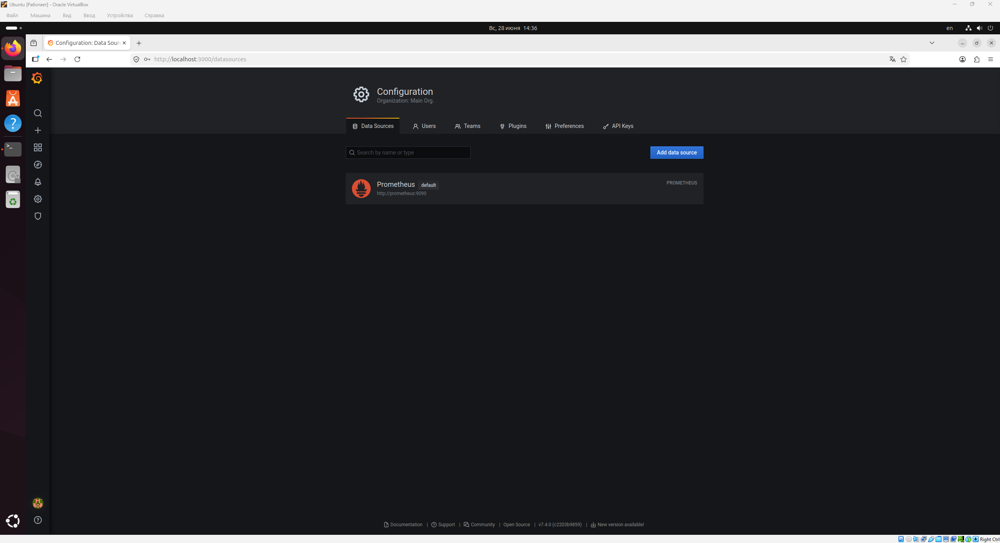
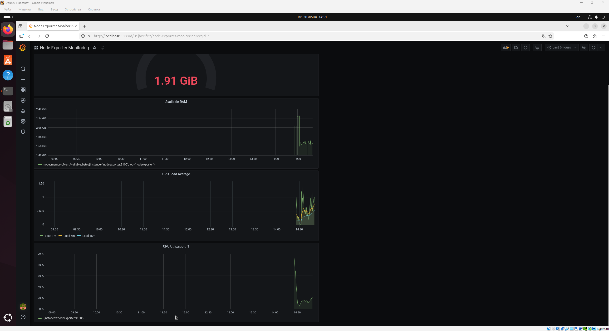
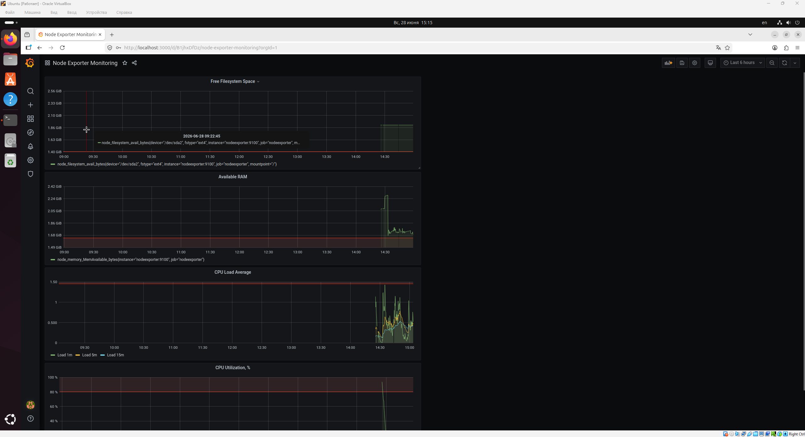

# Домашнее задание к занятию "`Средство визуализации Grafana`" - `Сунцов Андрей`

---

## Задание 1

---

## Задание 2

promql-запросы для выдачи метрик:

1. утилизация CPU для nodeexporter (в процентах, 100-idle): `100 - (avg by(instance) (rate(node_cpu_seconds_total{mode="idle"}[5m])) * 100)`
2. CPULA 1/5/15: `node_load1`, `node_load5`, `node_load15`
3. количество свободной оперативной памяти: `node_memory_MemAvailable_bytes`
4. количество места на файловой системе: `node_filesystem_avail_bytes{mountpoint="/",fstype!="rootfs"}`

---

## Задание 3

---

## Задание 4

---